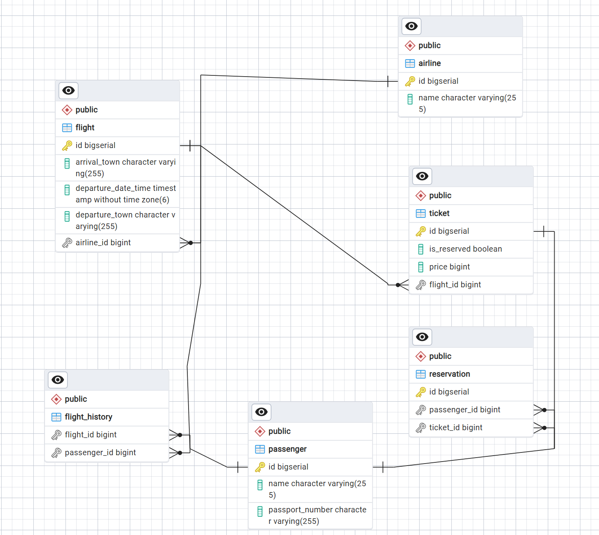

# AirlineTickets

This application represents a simple service for searching and booking airline tickets using the following technologies:
 - Java 17
 - Spring Web
 - Spring Data Jpa
 - PostgreSQL
 - AOP
 - Redis
 - Docker

## Description

The application allows managing a database of airline tickets, including adding new tickets, editing existing ones, searching, and removing outdated tickets.

## Code Quality 
SonarCloud was used to check the code quality.
You can find the project overview [here](https://sonarcloud.io/project/overview?id=Anton9372_AirlineTickets-java).

## Database Schema

## Deployed

https://airlinetickets-java.onrender.com

